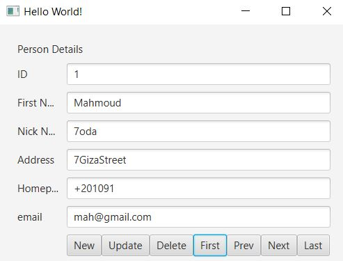
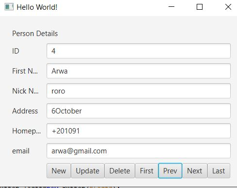

#   Hierarchy of Project

# JavaFX with Postgres 
### The project Consists of 2 classes *DB.java*  talking with database and controller.java which is the GUI application that retrieve the data from database using the ResultSet 

#  Screenshots for the project

> First Button

> Prev Button

> Next Button

> Last Button

